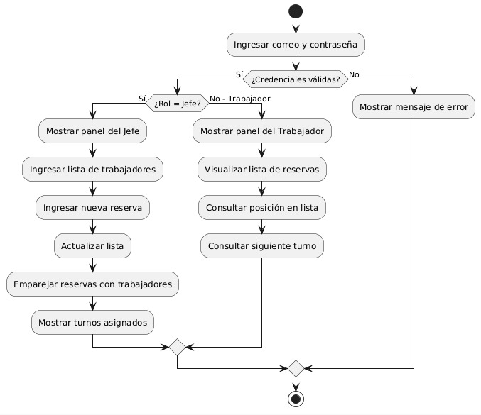
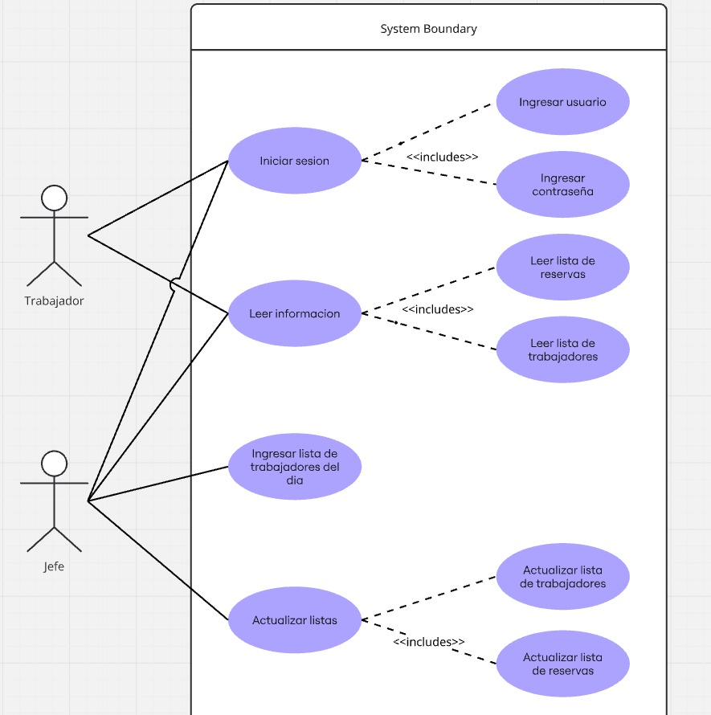
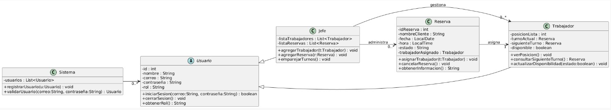

Contexto del Proyecto y Planteamiento del Problema

En el club deportivo, donde se ofrecen servicios en diferentes canchas de tenis, los empleados deben cumplir turnos en distintos campos según la demanda de los usuarios.

Actualmente, el registro de horas, pagos y asignación de personal se realiza de forma manual, lo cual genera desorden, retrasos en los pagos y confusión en la distribución de empleados.

Además, no existe un sistema que permita visualizar en tiempo real qué canchas están ocupadas, cuáles están disponibles y cuántos empleados se necesitan en cada una.

La asignación del personal se hace mediante sorteos y listas manuales, lo que dificulta su actualización cuando ingresan nuevos turnos o cuando un empleado finaliza su actividad.

Por otra parte, en el club de tenis ubicado en la ciudad, diariamente se presentan múltiples clientes, trabajadores (caddies) y administradores, pero no existe un sistema organizado para gestionar las reservas de canchas ni la asignación del personal.

Los clientes deben preguntar manualmente qué canchas están disponibles, lo que genera confusiones sobre horarios, ocupación y disponibilidad. Esto ocasiona retrasos, discusiones y pérdida de tiempo tanto para los clientes como para los administradores.

Asimismo, los caddies no tienen claridad sobre en qué cancha deben trabajar, por lo que deben consultar constantemente a los jefes, generando desorganización en los turnos. Al momento de realizar los pagos, el proceso también es lento, debido a que no existe un registro claro de las horas trabajadas ni de los servicios prestados.

Ante esta situación, se plantea el desarrollo de una plataforma web que permita administrar el funcionamiento del club de tenis, facilitando:

- La visualización de canchas disponibles y ocupadas en tiempo real.  
- El registro de clientes y asignación de canchas según disponibilidad.  
- La asignación de caddies a las canchas correspondientes.  
- El control de turnos y horas trabajadas.  
- El cálculo y pago de los trabajadores de forma rápida y organizada.  

Adicionalmente, la estructura utilizada en el desarrollo del proyecto tiene como propósito organizar la creación de la página web, permitiendo:

- Dividir las tareas entre los integrantes del grupo.  
- Mantener los archivos ordenados.  
- Facilitar la comprensión del proyecto.  
- Evitar errores en el desarrollo.  
- Mejorar el trabajo en equipo.

🎯 Objetivo General

Desarrollar una plataforma web que permita administrar de manera eficiente los turnos, pagos y la disponibilidad de canchas, optimizando el trabajo del personal y mejorando la experiencia de los usuarios.

---

📌 Objetivos Específicos

- Registrar las horas trabajadas por los empleados.
- Automatizar el cálculo de pagos.
- Visualizar el estado de las canchas en tiempo real.
- Asignar empleados según la demanda.
- Generar reportes administrativos.
- Reducir errores en la gestión manual.

---

📌 Alcance del Proyecto

El sistema permitirá:

- Registrar empleados y clientes.
- Gestionar turnos y horarios.
- Controlar la asignación de canchas.
- Calcular y generar pagos.
- Mostrar información actualizada.
- Generar reportes.

No incluirá sistemas externos de pago en línea en esta versión.

---

Requerimientos del Sistema de Gestión de Turnos y Pagos

 Actores
- Empleado
- Administrador
- Sistema

---

📊 Tabla de Requerimientos

| Actor         | Requerimiento Funcional                                              | Requerimiento No Funcional                                  |
|---------------|----------------------------------------------------------------------|--------------------------------------------------------------|
| Empleado      | Registrar inicio y fin de turno                                      | Tiempo de respuesta menor a 3 segundos                       |
| Empleado      | Consultar horas trabajadas                                           | Interfaz clara e intuitiva                                   |
| Empleado      | Consultar pagos                                                      | Compatible con dispositivos móviles                          |
| Empleado      | Ver asignación de cancha                                             | Actualización en tiempo real                                 |
| Empleado      | Visualizar lista de turnos                                           | Información siempre sincronizada                             |
| Administrador | Registrar empleados                                                  | Acceso mediante autenticación segura                         |
| Administrador | Visualizar estado de las canchas                                     | Refresco automático de información                           |
| Administrador | Asignar empleados a canchas                                          | Cambios reflejados inmediatamente                             |
| Administrador | Aprobar turnos                                                       | Permisos por rol                                              |
| Administrador | Registrar clientes                                                   | Protección de datos                                           |
| Administrador | Generar reportes                                                     | Reportes sin errores                                          |
| Administrador | Configurar horarios                                                  | Disponibilidad 24/7                                           |
| Administrador | Autorizar pagos                                                      | Información cifrada                                           |
| Sistema       | Calcular pagos automáticamente                                      | Precisión del 99.9%                                           |
| Sistema       | Actualizar lista de asignación                                       | Sincronización en tiempo real                                 |
| Sistema       | Enviar notificaciones                                                | Entrega inmediata                                             |
| Sistema       | Almacenar información                                                | Respaldo automático diario                                    |

---

## 📈 Diagramas del Sistema

### 📌 Diagrama de Flujo

### 📌 Diagrama de Casos de Uso

### 📌 Diagrama de Clases

---

🛠️ Tecnologías Utilizadas

- HTML5  
- CSS 
- JavaScript  
- GitHub  
- Visual Studio Code  

---

## 📂 Estructura del Proyecto

/gestion-turnos
│

├── /imagenes

│ ├── flujo.png

│ ├── casos_uso.png

│ └── canchas.png

│
├── index.html

├── styles.css

├── script.js

└── README.md

---

📌 Metodología de Desarrollo

El proyecto se desarrolla mediante una metodología incremental, permitiendo construir el sistema por partes, realizar pruebas constantes y aplicar mejoras continuas.
---  

📌 Conclusión

La implementación de este sistema permitirá optimizar la asignación del personal, mejorar el control de pagos y ofrecer una gestión moderna y eficiente del club deportivo. Gracias a esta organización, el proyecto se puede desarrollar de manera más eficiente, clara y funcional, ofreciendo una solución tecnológica que optimice el tiempo, reduzca errores y mejore la experiencia tanto de los clientes como del personal del club.

---

✍️ Autores

Hayder Duván Carreño Ramos

Juan Esteban Bustos Rojas

Miguel Eduardo Angulo Cantor

Juan Felipe Rojas Caceres
