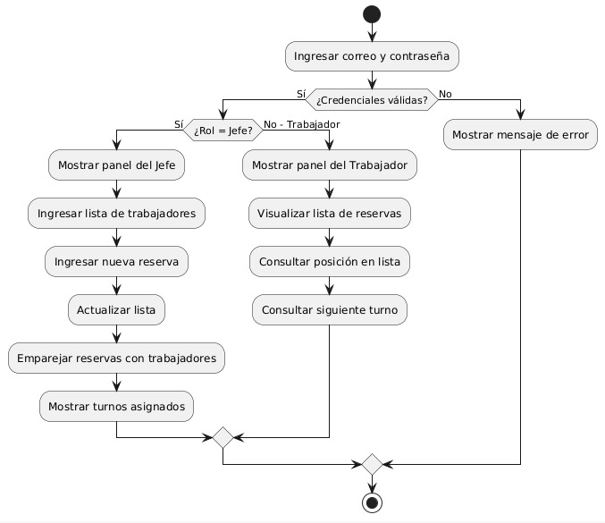
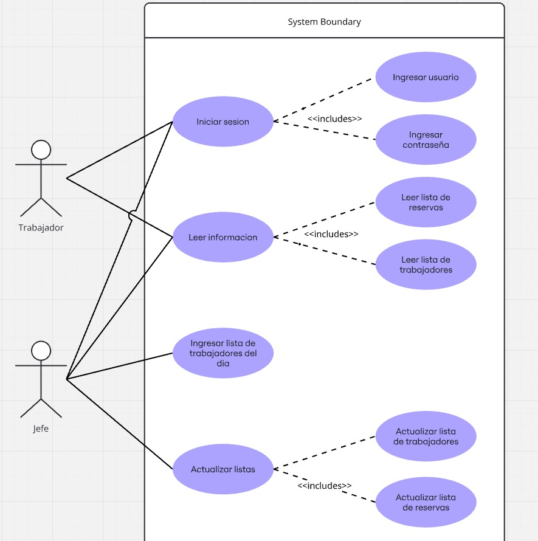
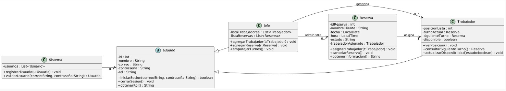

Contexto del Proyecto y Planteamiento del Problema

En el club deportivo, donde se ofrecen servicios en diferentes canchas de tenis, los empleados deben cumplir turnos en distintos campos según la demanda de los usuarios.

Actualmente, el registro de horas, pagos y asignación de personal se realiza de forma manual, lo cual genera desorden, retrasos en los pagos y confusión en la distribución de empleados.

Además, no existe un sistema que permita visualizar en tiempo real qué canchas están ocupadas, cuáles están disponibles y cuántos empleados se necesitan en cada una.

La asignación del personal se hace mediante sorteos y listas manuales, lo que dificulta su actualización cuando ingresan nuevos turnos o cuando un empleado finaliza su actividad.

Por otra parte, en el club de tenis ubicado en la ciudad, diariamente se presentan múltiples clientes, trabajadores (caddies) y administradores, pero no existe un sistema organizado para gestionar las reservas de canchas ni la asignación del personal.

Los clientes deben preguntar manualmente qué canchas están disponibles, lo que genera confusiones sobre horarios, ocupación y disponibilidad. Esto ocasiona retrasos, discusiones y pérdida de tiempo tanto para los clientes como para los administradores.

Asimismo, los caddies no tienen claridad sobre en qué cancha deben trabajar, por lo que deben consultar constantemente a los jefes, generando desorganización en los turnos. Al momento de realizar los pagos, el proceso también es lento, debido a que no existe un registro claro de las horas trabajadas ni de los servicios prestados.

Ante esta situación, se plantea el desarrollo de una plataforma web que permita administrar el funcionamiento del club de tenis, facilitando:

- La visualización de canchas disponibles y ocupadas en tiempo real.  
- El registro de clientes y asignación de canchas según disponibilidad.  
- La asignación de caddies a las canchas correspondientes.  
- El control de turnos y horas trabajadas.  
- El cálculo y pago de los trabajadores de forma rápida y organizada.  

Adicionalmente, la estructura utilizada en el desarrollo del proyecto tiene como propósito organizar la creación de la página web, permitiendo:

- Dividir las tareas entre los integrantes del grupo.  
- Mantener los archivos ordenados.  
- Facilitar la comprensión del proyecto.  
- Evitar errores en el desarrollo.  
- Mejorar el trabajo en equipo.

🎯 Objetivo General

Desarrollar una plataforma web que permita administrar de manera eficiente los turnos, pagos y la disponibilidad de canchas, optimizando el trabajo del personal y mejorando la experiencia de los usuarios.

---

📌 Objetivos Específicos

- Registrar las horas trabajadas por los empleados.
- Automatizar el cálculo de pagos.
- Visualizar el estado de las canchas en tiempo real.
- Asignar empleados según la demanda.
- Generar reportes administrativos.
- Reducir errores en la gestión manual.

---

📌 Alcance del Proyecto

El sistema permitirá:

- Registrar empleados y clientes.
- Gestionar turnos y horarios.
- Controlar la asignación de canchas.
- Calcular y generar pagos.
- Mostrar información actualizada.
- Generar reportes.

No incluirá sistemas externos de pago en línea en esta versión.

---

Requerimientos del Sistema de Gestión de Turnos y Pagos

 Actores
- Empleado
- Administrador
- Sistema

---

📊 Tabla de Requerimientos

| Actor         | Requerimiento Funcional                                              | Requerimiento No Funcional                                  |
|---------------|----------------------------------------------------------------------|--------------------------------------------------------------|
| Empleado      | Registrar inicio y fin de turno                                      | Tiempo de respuesta menor a 3 segundos                       |
| Empleado      | Consultar horas trabajadas                                           | Interfaz clara e intuitiva                                   |
| Empleado      | Consultar pagos                                                      | Compatible con dispositivos móviles                          |
| Empleado      | Ver asignación de cancha                                             | Actualización en tiempo real                                 |
| Empleado      | Visualizar lista de turnos                                           | Información siempre sincronizada                             |
| Administrador | Registrar empleados                                                  | Acceso mediante autenticación segura                         |
| Administrador | Visualizar estado de las canchas                                     | Refresco automático de información                           |
| Administrador | Asignar empleados a canchas                                          | Cambios reflejados inmediatamente                             |
| Administrador | Aprobar turnos                                                       | Permisos por rol                                              |
| Administrador | Registrar clientes                                                   | Protección de datos                                           |
| Administrador | Generar reportes                                                     | Reportes sin errores                                          |
| Administrador | Configurar horarios                                                  | Disponibilidad 24/7                                           |
| Administrador | Autorizar pagos                                                      | Información cifrada                                           |
| Sistema       | Calcular pagos automáticamente                                      | Precisión del 99.9%                                           |
| Sistema       | Actualizar lista de asignación                                       | Sincronización en tiempo real                                 |
| Sistema       | Enviar notificaciones                                                | Entrega inmediata                                             |
| Sistema       | Almacenar información                                                | Respaldo automático diario                                    |

---

## 📈 Diagramas del Sistema

### 📌 Diagrama de Flujo

### 📌 Diagrama de Casos de Uso

### 📌 Diagrama de Clases

---

🛠️ Tecnologías Utilizadas

- HTML5  
- CSS 
- JavaScript  
- GitHub  
- Visual Studio Code  

---

## 📂 Estructura del Proyecto

/gestion-turnos
│

├── /imagenes

│ ├── flujo.png

│ ├── casos_uso.png

│ └── canchas.png

│
├── index.html

├── styles.css

├── script.js

└── README.md

#  Sistema de Gestión de Turnos y Pagos – Club de Tenis

## 📖 Descripción del Proyecto

Este proyecto corresponde a un sistema web para la gestión de canchas, empleados, turnos y pagos en un club de tenis, permitiendo una administración eficiente, segura y organizada de los recursos.

El sistema está desarrollado utilizando tecnologías web modernas y una arquitectura profesional orientada a la escalabilidad y el trabajo en equipo.

---

#  Implementación de la Arquitectura

## Arquitectura del Sistema

Para el desarrollo del Sistema de Gestión de Turnos y Pagos del Club de Tenis, se implementa una **Arquitectura Cliente-Servidor en Tres Capas**, utilizando el patrón de diseño **MVC (Modelo – Vista – Controlador)**.

Esta arquitectura permite separar responsabilidades, mejorar la organización del código y facilitar el mantenimiento, escalabilidad y desarrollo colaborativo.

Se adopta esta arquitectura debido a las necesidades funcionales, de crecimiento y trabajo en equipo del proyecto, garantizando una estructura clara entre interfaz, lógica y datos.

---

## Arquitectura en Tres Capas

El sistema está dividido en las siguientes capas:

###  Capa de Presentación (Frontend)

Corresponde a la interfaz gráfica con la que interactúan los usuarios (Administrador y Empleados).

Esta capa permite visualizar en tiempo real el estado de las canchas y turnos, mejorando la experiencia del usuario sin afectar la lógica interna del sistema.

Además, facilita el trabajo en equipo mediante GitHub, permitiendo que algunos integrantes trabajen en diseño mientras otros desarrollan la lógica.

**Tecnologías:**

* HTML5
* CSS
* JavaScript

**Funciones principales:**

* Formularios de inicio de sesión y registro
* Visualización del estado de las canchas
* Panel administrativo
* Registro de turnos
* Visualización de pagos
* Generación de reportes

Esta capa se ejecuta en el navegador y se comunica con el servidor mediante peticiones HTTP.

---

###  Capa de Lógica de Negocio (Backend)

Se encarga de procesar la información enviada desde el frontend y aplicar las reglas del sistema.

**Tecnologías:**

* Node.js
* Express.js

**Funciones principales:**

* Autenticación de usuarios
* Registro y actualización de empleados y clientes
* Asignación de canchas
* Control de turnos
* Cálculo automático de pagos
* Generación de reportes
* Validación de datos

El backend actúa como intermediario entre el frontend y la base de datos, garantizando seguridad y organización.

---

###  Capa de Datos (Base de Datos)

Permite almacenar la información de forma persistente.

**Base de datos propuesta:**

* Firebase

**Datos almacenados:**

* Usuarios
* Clientes
* Canchas
* Turnos
* Pagos
* Reportes históricos

Esta capa permite el acceso desde cualquier dispositivo y evita la dependencia del almacenamiento local.

---

##  Patrón de Diseño: MVC

El sistema implementa el patrón **Modelo – Vista – Controlador (MVC)** para una mejor organización.

### Modelo (Model)

Representa los datos del sistema: usuarios, canchas, turnos y pagos.

### Vista (View)

Corresponde a la interfaz desarrollada con HTML, CSS y JavaScript.

### Controlador (Controller)

Gestiona las solicitudes del usuario, procesa la lógica y comunica la vista con el modelo.

### Beneficios del MVC

* Separación de responsabilidades
* Fácil mantenimiento
* Mejor escalabilidad
* Optimización del trabajo en equipo

---

##  Flujo de Funcionamiento

1. El usuario accede desde el navegador.
2. El frontend envía una solicitud al backend.
3. El backend procesa la solicitud.
4. Se consulta la base de datos.
5. La base de datos responde.
6. El backend envía la respuesta.
7. El frontend actualiza la interfaz.

Este flujo garantiza una gestión segura y eficiente.

---

##  Justificación de la Arquitectura

Inicialmente, el sistema utilizaba almacenamiento local (localStorage), lo cual limitaba su uso a un solo dispositivo.

Con la implementación Cliente-Servidor se logra:

* Acceso multiusuario
* Persistencia real
* Mayor seguridad
* Escalabilidad
* Mejor control administrativo
* Estándares profesionales

---

##  Beneficios de la Arquitectura

* Código organizado
* Mejor rendimiento
* Trabajo colaborativo
* Reducción de errores
* Separación clara de responsabilidades
* Preparación para futuras mejoras

---

# 🌐 Uso del DOM en el Proyecto

## ¿Qué es el DOM?

El DOM (Document Object Model) representa la estructura del documento HTML como un árbol de nodos que permite manipular la página desde JavaScript.

Nuestro sistema utiliza el DOM para interactuar dinámicamente con los elementos del sistema.

---

## Selección de Elementos

Se usan selectores para acceder a:

* Formularios
* Botones
* Listas de turnos
* Campos de búsqueda

**Métodos:**

* getElementById()
* querySelector()
* querySelectorAll()

---

## Modificación del DOM

Permite actualizar la información en tiempo real.

### Aplicaciones:

* Mostrar turnos disponibles
* Actualizar empleados
* Cambiar estados de canchas
* Mostrar mensajes

### Técnicas:

* innerText
* innerHTML
* classList
* style

---

## Manejo de Eventos

El sistema responde a las acciones del usuario mediante eventos.

### Eventos:

* Click
* Submit
* Change
* Selección de fechas

Se utiliza `addEventListener()` para:

* Registrar turnos
* Guardar datos
* Cancelar reservas
* Validar información

---

## Propagación y Delegación de Eventos

Se controla la propagación usando:

* event.stopPropagation()
* event.preventDefault()

Y se aplica delegación en listas dinámicas para mejorar el rendimiento.

---

##  Seguridad y innerHTML

El uso incorrecto de `innerHTML` puede generar ataques XSS.

### Medidas:

* Validar entradas
* Usar textContent
* Limpiar datos
* Evitar scripts externos

---

##  Rendimiento

Buenas prácticas:

* Guardar referencias del DOM
* Evitar consultas repetidas
* Optimizar ciclos
* Usar fragmentos

---

##  Separación de Responsabilidades

* HTML → Estructura
* CSS → Diseño
* JavaScript → Lógica

Esto facilita el mantenimiento y la organización.

---

##  Ciclo de Vida del Documento

Se controla la carga usando:

* DOMContentLoaded
* window.onload

Evita errores por elementos no cargados.

---

##  Beneficios del Uso del DOM

* Automatización de reservas
* Control de disponibilidad
* Gestión eficiente
* Menos errores
* Mejor experiencia de usuario

---

#  Conclusión

El sistema implementa una arquitectura profesional Cliente-Servidor con patrón MVC y un uso eficiente del DOM.

Esto garantiza:

* Organización
* Seguridad
* Escalabilidad
* Mantenimiento sencillo
* Preparación para crecimiento futuro

El proyecto cumple con los principios de Ingeniería Web y buenas prácticas de desarrollo.

---

📌 Metodología de Desarrollo

El proyecto se desarrolla mediante una metodología incremental, permitiendo construir el sistema por partes, realizar pruebas constantes y aplicar mejoras continuas.
---  

📌 Conclusión

La implementación de este sistema permitirá optimizar la asignación del personal, mejorar el control de pagos y ofrecer una gestión moderna y eficiente del club deportivo. Gracias a esta organización, el proyecto se puede desarrollar de manera más eficiente, clara y funcional, ofreciendo una solución tecnológica que optimice el tiempo, reduzca errores y mejore la experiencia tanto de los clientes como del personal del club.

---

✍️ Autores

Hayder Duván Carreño Ramos

Juan Esteban Bustos Rojas

Miguel Eduardo Angulo Cantor

Juan Felipe Rojas Caceres
